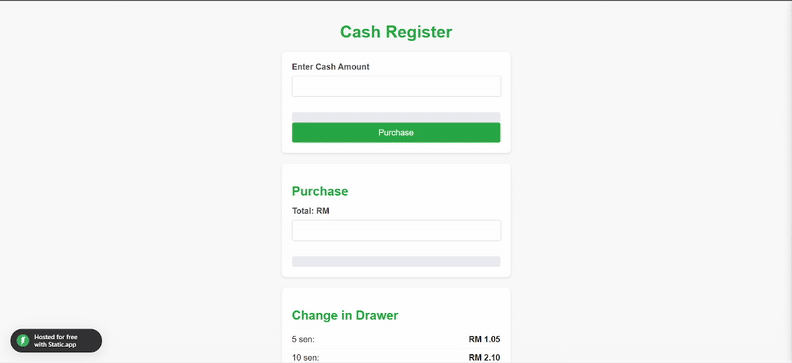

# Cash Register Manager 💰

A JavaScript application that helps shopkeepers calculate the minimum number of notes to return as change to customers.

## Features ✨

- Calculates exact change to be returned
- Shows breakdown by currency denomination
- Handles all edge cases (exact amount, insufficient cash)
- Clean, intuitive user interface
- Mobile-responsive design

## Technologies Used 🛠️

- HTML5
- CSS3 (with Flexbox)
- Vanilla JavaScript

## Live Demo 🌐

[Try it live here!](https://mohamedimran7868.github.io/Cash-Register/)

## How to Use 📝

1. Enter the bill amount
2. Enter the cash given by customer
3. Click "Calculate" to see:
   - Total change amount
   - Exact denomination breakdown
   - Warning messages if needed
